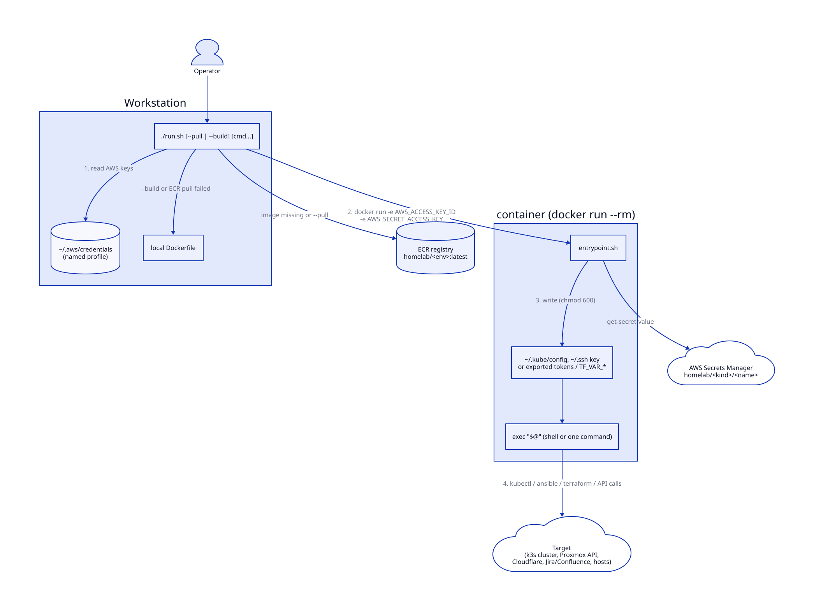

# containerized-infra-toolchain

Per-cluster and per-tool Docker execution environments for running infrastructure CLIs
(kubectl/helm/k9s, Ansible, Terraform, the Proxmox API, the Cloudflare API, Jira/Confluence,
DNS and network debugging) **without installing them on the workstation and without
storing long-lived credentials on disk in plaintext configs**.

Each environment is a small image plus a `run.sh` launcher. Anything sensitive (a kubeconfig,
an SSH key, an API token) is pulled from **AWS Secrets Manager when the container starts** and
lives only inside that throwaway container.

> This is extracted from a working homelab toolchain. Host names, IP addresses
> (RFC 5737 documentation ranges), the AWS account ID and secret names are placeholders.

## The pattern



The numbers follow one run: read the AWS keys, start the container with them, fetch and write the secret inside the container, then run the command against the target.

- **One small image per tool or cluster.** `kubectl-k3s-main` can only ever talk to one cluster;
  there is no shared kubeconfig with a dozen contexts to get wrong.
- **`run.sh` is the only entry point.** It resolves the image, reads AWS credentials from a named
  profile, and runs the container with `--rm` (and `--network host` where the tool needs LAN access).
- **`entrypoint.sh` fetches the secret, then `exec`s the command.** With no arguments you get an
  interactive shell; with arguments it runs them and exits, so the envs also work from scripts
  and CI (`./run.sh 'kubectl get pods -A'`).
- **`--pull` / `--build`.** `--pull` logs in to ECR and refreshes the image; `--build` builds from
  the local Dockerfile. If no image exists locally, `run.sh` tries ECR first and falls back to a
  local build.
  `atlassian` is the exception: it has no ECR image and builds `homelab-tools-base` and then
  itself locally on first use (`--build` forces a rebuild of both).

## Environments

| Environment | Image base | Secret fetched at start | What it's for |
|-------------|-----------|--------------------------|---------------|
| `kubectl-k3s-main` | alpine + kubectl, helm, k9s | `homelab/kubeconfig/k3s-main` | Main K3s cluster (media and app workloads) |
| `kubectl-k3s-util` | alpine + kubectl, helm, k9s | `homelab/kubeconfig/k3s-util` | Utility K3s cluster (DNS, CI-adjacent services) |
| `kubectl-k3s-public` | alpine + kubectl, helm, k9s | `homelab/kubeconfig/k3s-public` | Single-node K3s on a public cloud droplet |
| `ansible-local` | alpine + ansible, common collections | `homelab/ssh/deploy-ansible` | Run/test playbooks from a read-only mount of an Ansible repo |
| `terraform` | `hashicorp/terraform:1.9` | `homelab/proxmox/token` → `TF_VAR_*` | fmt / validate / plan / apply against Proxmox; `fmt` needs no secrets |
| `proxmox` | python:3.11-slim + proxmoxer | `homelab/proxmox/token` | `pxm` CLI: VMs, nodes, storage, snapshots, templates |
| `cloudflare-tools` | alpine + curl/jq | `homelab/cloudflare/api-token` | Tunnel ingress rules, DNS zones, Worker deploys |
| `atlassian` | `homelab-tools-base` (`_shared/`) | `homelab/atlassian/creds` | Jira/Confluence Cloud REST scripts (create, search, transition, worklog, pages) |
| `coredns-tools` | alpine + dig/drill/whois | none | Query and health-check internal DNS |
| `network-debug` | alpine + nmap, mtr, tcpdump, tshark, iperf3 | none | Port/HTTP/latency checks, scans, captures (`NET_RAW`/`NET_ADMIN`) |

`_shared/` holds `Dockerfile.base` and `lib/common.sh` (logging, `secrets_fetch`, `require`,
`ntfy_notify`), used as the base image for the newer API-tool environments such as `atlassian`.

## Usage

```bash
cd environments/kubectl-k3s-main
./run.sh                               # interactive shell, kubeconfig already loaded
./run.sh get-pods media                # helper script baked into the image
./run.sh 'kubectl rollout status deploy/web -n apps'
./run.sh --pull                        # refresh from ECR
./run.sh --build                       # build locally instead

cd ../terraform
./run.sh fmt-check                     # no secrets needed
TF_CODEBASE=~/src/terraform-proxmox ./run.sh plan dev

cd ../atlassian
./run.sh /scripts/search.sh 'project = KAN AND status != Done'
```

### Launcher settings

| Variable | Default | Used by |
|----------|---------|---------|
| `AWS_PROFILE_NAME` | `deploy` | every env that needs Secrets Manager or ECR |
| `AWS_CLI` | `aws` on `PATH` | every env |
| `ECR_REGISTRY` | `123456789012.dkr.ecr.us-west-2.amazonaws.com` | `--pull` and first-run pull |
| `MANIFESTS_DIR` | unset | kubectl envs: optional host dir mounted read-only at `/manifests` |
| `ANSIBLE_REPO_PATH` | `~/src/ansible` | `ansible-local` |
| `TF_CODEBASE` | `~/src/terraform-proxmox` | `terraform` |
| `PROXMOX_HOST` | `pve1` | `proxmox` |
| `CF_ACCOUNT_ID`, `CF_TUNNEL_NAME` | required / `homelab` | `cloudflare-tools` |
| `DNS_SERVER`, `DNS_CHECK_HOSTS` | `192.0.2.169` / example hosts | `coredns-tools` |

## Security model

- **Nothing is baked into images.** Dockerfiles install tools only. Kubeconfigs, SSH keys and
  API tokens are fetched by `entrypoint.sh` at container start and either written to a file
  inside the container (`chmod 600`) or exported as environment variables for the tool. They're
  gone when the `--rm` container exits. Images can be
  pushed to a registry without exposing anything.
- **AWS keys never appear in the process list.** Each `run.sh` reads the keys from the named
  profile, `export`s them, and passes them to Docker as bare `-e AWS_ACCESS_KEY_ID
  -e AWS_SECRET_ACCESS_KEY` (never `-e VAR=$VALUE`). Docker reads the values from the launcher's
  environment, so they don't appear in `ps` output or `/proc/*/cmdline`.
- **Secrets Manager is the single source of truth.** Rotating a kubeconfig or token is a
  `put-secret-value`; the next container start picks it up, and there's nothing to redistribute.
- **Least privilege by construction.** Each image knows about exactly one secret path. The IAM
  identity behind the profile can be limited to `secretsmanager:GetSecretValue` on
  `homelab/*` plus ECR pull.
- **Read-only mounts** where the container only needs to read (`ansible-local` workspace,
  `/manifests`, the Atlassian `scripts/`).

## Layout

```
environments/
  _shared/                 Dockerfile.base + lib/common.sh (shared base for API-tool envs)
  <env>/
    Dockerfile             tools only
    entrypoint.sh          fetch secret(s) from Secrets Manager, then exec "$@"
    run.sh                 image resolve (--pull/--build) + credential hand-off + docker run
    scripts/               small helpers copied onto PATH in the image
    README.md              per-environment usage
```

(`terraform` keeps its entrypoint at `scripts/entrypoint.sh`; `coredns-tools` and
`network-debug` need no secrets and have no entrypoint.)

## Requirements

- Docker
- AWS CLI v2 with a profile that can read the `homelab/*` secrets (and pull from ECR if you use `--pull`)
- Secrets created in AWS Secrets Manager under the names in the table above
- Network reachability from the workstation to whatever the environment manages

## License

MIT. See [LICENSE](LICENSE).
